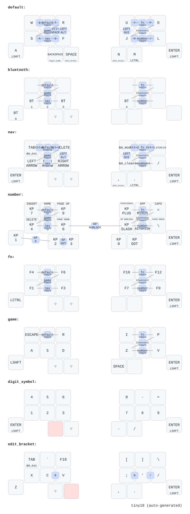

# Tiny18 ZMK ファームウェア（lunelukkio の fork）

Seeed Studio XIAO nRF52840 を2個使う18キー左右分割キーボード [Tiny18](https://github.com/k3peta/tiny18) 用の ZMK ファームウェアです。Tiny18 の設計、基板、元のファームウェアは k3peta さんの作です。このリポジトリは [k3peta/zmk-config-tiny18](https://github.com/k3peta/zmk-config-tiny18) の fork で、個人用のキーマップと、外付けの学習用表示器へ現在のレイヤーを送る小さなモジュールを載せています。

## 上流との違い

- **キーマップ。** 6つのモードと押しっぱなしで開く2つの面、全8レイヤー、combo 24個。右手はトラックボールの上に置いたままなので、日常的に使う操作は左手9キーに収めてあります。配置図と理由は [lunelukkio.com/public/tiny18/keymap.html](https://lunelukkio.com/public/tiny18/keymap.html) にまとめてあります。
- **右手の uf2 は1種類。** `tiny18-right.uf2` の AI モードは矢印が逆 T 字です。W の位置は Escape、Shift 中は Tab、R の位置は BackSpace、Shift 中は Delete です。右上段は `Ctrl+Z`、`Ctrl+Shift+Z`、`Ctrl+X`。右手の6キーは Shift を押さえている間、`/model`、`/resume`、`/status`、`/clear`、`/context`、`/permissions` になります。
- **起動時は AI。** 電源投入、リセット、deep sleepからの復帰はいずれもAIモードから始まります。右手のRGB LEDは青で始まり、文字を入力するときは従来どおりcomboで文字入力モードへ切り替えます。
- **レイヤーの色。** 右手側の RGB LED がモードを示します。文字入力は緑、AI は青、数字キーパッドは黄、ゲームはシアン、ファンクションはマゼンタ、Bluetooth は赤、押しっぱなしの面を開いている間は白です。
- **deep sleep。** 左右とも無操作30分で眠ります（`CONFIG_ZMK_SLEEP=y`、`CONFIG_ZMK_IDLE_SLEEP_TIMEOUT=1800000`）。起こすには右手側のキーを1回押す必要があり、その打鍵は送られません。
- **学習用表示器。** [`src/layer_uart.c`](src/layer_uart.c) が UART1（D1、送信のみ、9600 baud、8N1）で状態1 byte を送ります。起動時、レイヤーか押している修飾キーが変わったとき、キーを押したときに送り、bit 0〜2 が最高位のレイヤー、bit 3〜6 が Shift、Ctrl、Alt、GUI です。USB 給電の CH32V003 基板が透明 OLED に現在のキー配置を描きます。受信側のファームウェアは [lunelukkio/t-display](https://github.com/lunelukkio/t-display) にあります。右手側の `CONFIG_TINY18_LAYER_UART=y` で有効になります。

## キーマップ

キーマップの正本は [`config/tiny18.keymap`](config/tiny18.keymap) で、判断の理由はその中のコメントに書いてあります。[`build.yaml`](build.yaml) は左右に1種類ずつのファームウェアを作ります。ファームウェア関連のファイルを push すると GitHub Actions が [`keymap-drawer/tiny18.svg`](keymap-drawer/tiny18.svg) を描き直します。

| モード | レイヤー | 入り方 | 用途 |
| --- | --- | --- | --- |
| 文字入力 | 0 | `W + R` | 文字 |
| AI | 2 | `S + F` | 起動時のモード。逆T字の矢印、Escape/Tab、BackSpace/Delete、右上段の元に戻す・やり直す・切り取り、Shift中の6つのslash command、右手の句読点、コピーと貼り付けのcombo |
| 数字キーパッド | 3 | `J + L` | テンキーのコード。日本語入力でも半角のまま通る |
| ゲーム | 5 | `R + S` | VRChat 用の WASD と、R I O P、チャット用のキー |
| ファンクション | 4 | `U + O` | F1 から F12 |
| Bluetooth | 1 | `O + J` | 接続プロファイルの切り替え |

モードの切り替えはモードごとに 2 キーの combo が 1 つです。ゲームモード内では AI モード行きとゲームモード行きが無効です。切替comboは打鍵後 150 ms おかないと効きません。ほかに親指を押さえている間だけ開く面が 2 つあります。BackSpace で数字と記号の面、Space か N で ZXCV の面です。面はレイヤー 6 と 7 で、いちばん大きい番号です。文字入力の親指を残しているモードから開けます。

キーは文字入力モードで出る文字の名前で呼びます。

- 文字入力の `A` はタップで A、350 ms 以上の長押しで Shift です。一度タップしてすぐにもう一度押さえ続けると、2回目は A のまま保持されて OS の自動反復になります。`Enter` は文字入力を含むすべてのモードと面で hold-tap です。軽く叩けば Enter、押さえれば Shift になります。AI モードと数字・記号の面では `A` の位置も Enter / Shift で、同じく左小指向けの判定は 350 ms です。ゲームモードの `A` の位置だけは素の Shift です。
- `BackSpace` を押さえると数字の面、`Space` か `N` を押さえると ZXCV の面、`M` を押さえると Ctrl です。左の親指 2 つは、数字キーパッドモードとゲームモード以外でこの割り当てです。
- `E + F` の同時押しで日本語と英語を切り替えます（Ctrl+Space）。文字入力モードだけで、打鍵後 150 ms おいてから効きます。AI モードの6つのslash commandは USB の `LANG2` キーを送り、Windows では IME オフ、macOS では英数として届くので、IME が日本語のままでも ASCII で届きます。
- キーを持たない文字は隣り合う 2 キーで出します。文字入力モードでは `Q T Y P G H`、ZXCV の面では `B` です。`A` はキーと combo の両方で出ます。
- Alt は `R + F`、GUI は `U + J` で、文字入力モードと AI モードで同じです。

## ダウンロード

タグを打ったバージョンの UF2 は [Releases](https://github.com/lunelukkio/zmk-config-tiny18/releases) にあり、有効期限はありません。`v0.x.y` は実機確認中の pre-release で、1.0 より前の互換性は保証しません。`main` は最新の Release より進んでいることがあります。最新の [ビルド実行](https://github.com/lunelukkio/zmk-config-tiny18/actions/workflows/build.yml) の `firmware` アーティファクトが現在のイメージですが、こちらには期限があります。

| ファイル | 書き込み先 |
| --- | --- |
| `tiny18-right.uf2` | 右手側。AI モードの矢印は普通の逆 T 字。Bluetooth 中央側、ZMK Studio 接続側、学習用表示器の送信側 |
| `tiny18-left.uf2` | 左手側。Bluetooth 周辺側 |
| `settings-reset.uf2` | 保存された Bluetooth・左右接続情報の消去 |
| `SHA256SUMS` | 3つの UF2 の SHA-256 チェックサム |

左右のファイルは入れ替えられません。取り違えたら、もう一度ブートローダーへ入り、正しい UF2 を書き込んでください。キーマップを解釈するのは右手側だけです。左右とも同じビルドの UF2 を書き込んでください。

## 書き込み

1. キーボードのバッテリー電源を切り、USBデータケーブルで片側をPCへ接続します。
2. XIAO のリセットボタンを素早く2回押します。`XIAO-SENSE` ドライブが表示されます。
3. 右手側には `tiny18-right.uf2`、左手側には `tiny18-left.uf2` をコピーします。
4. USBを外して左右の電源を入れ、PCのBluetooth設定から `tiny18` をペアリングします。

### v0.1.0 を導入するとき

1. [v0.1.0 の Release](https://github.com/lunelukkio/zmk-config-tiny18/releases/tag/v0.1.0) から `tiny18-right.uf2` と `tiny18-left.uf2` を取得します。
2. 右手と左手をそれぞれブートローダーへ入れ、対応する UF2 を片方ずつコピーします。コピー後に `XIAO-SENSE` が消えてから、もう片方へ進みます。
3. 両方を書き込んでから電源を入れ直します。この版では macro と combo の定義も変わっているため、片手だけを旧版のまま使わないでください。
4. 学習用 OLED を使う場合は、同じ keymap の `tiny18_layer.bin` を UIAPduino へ書き込みます。[t-display の tiny18-layer firmware](https://github.com/lunelukkio/t-display/tree/main/firmware/tiny18-layer) を更新してbuildし、UIAPduinoへ書き込みます。

初回導入時や接続不調時は、両側へ `settings-reset.uf2` を書き込んでから、改めて左右それぞれの UF2 を書き込んでください。PCに残っている古い `tiny18` のペアリングも削除してから再接続します。

右手側では ZMK Studio が有効です。Studio で編集したキーマップは設定領域に保存され、コンパイル済みのものより優先されます。書き込んだはずのキーマップが出てこないときは、先に `settings-reset.uf2` を書き込んでください。

## 自分でビルドする

ファームウェア関連ファイルを push すると GitHub Actions が3つの UF2 を自動ビルドします。再現性を保つため、ZMK と RGB LED モジュールはいずれも `v0.3.0` に固定しています。

1. このリポジトリを fork します。
2. fork 側で GitHub Actions を有効にします。
3. 必要なら `config/tiny18.keymap` を変更します。
4. push 後、成功した Actions 実行の `firmware` アーティファクトを取得します。

公開前の版は `v0.1.0` のようなtagをpushします。リリース用workflowが同じcommitをbuildし、チェックサム付きのpre-releaseを自動作成します。実機で互換性を確認してから1.0以降へ進めます。

### ビルドの内訳

[`build.yaml`](build.yaml) は次の3つを作ります。

- 右手側。RGB LED のレイヤー・電池表示、USB 経由の ZMK Studio、レイヤー送信用 UART 付き
- 左手側。RGB LED のレイヤー・電池表示付き
- 復旧用の settings-reset

## リポジトリの構成

| パス | 役割 |
| --- | --- |
| `config/tiny18.keymap` | キーマップの正本 |
| `config/tiny18_*.conf` | 左右それぞれの ZMK 設定。LED の色、deep sleep、右手側は ZMK Studio とレイヤー送信 UART |
| `boards/shields/tiny18/` | Tiny18 のシールド定義と direct-pin の配線。右手側の overlay が D1 に UART1 を足す |
| `src/layer_uart.c`、`src/start_in_ai.c`、`Kconfig`、`CMakeLists.txt`、`zephyr/module.yml` | 学習用表示器への送信とAIモードでの起動。このリポジトリ自体を Zephyr モジュールとしてビルドする |
| `build.yaml` | ビルドの組み合わせと成果物の名前 |
| `keymap-drawer/` | 自動生成のキーマップ図 |
| `.github/workflows/build.yml` | 継続的ビルドと図の生成 |
| `.github/workflows/release.yml` | タグからの恒久的なリリース |

## ハードウェア

PCB製造データ、BOM、発注時の注意は [Tiny18 ハードウェアリポジトリ](https://github.com/k3peta/tiny18) にあります。このリポジトリにハードウェアのファイルはありません。

## ライセンス

Tiny18 固有の設定・シールド定義は [MIT License](LICENSE) で公開します。`LICENSE` の著作権表記は上流の作者のもので、fork でもそのまま残しています。ZMK と外部モジュールには、それぞれのライセンスが適用されます。
